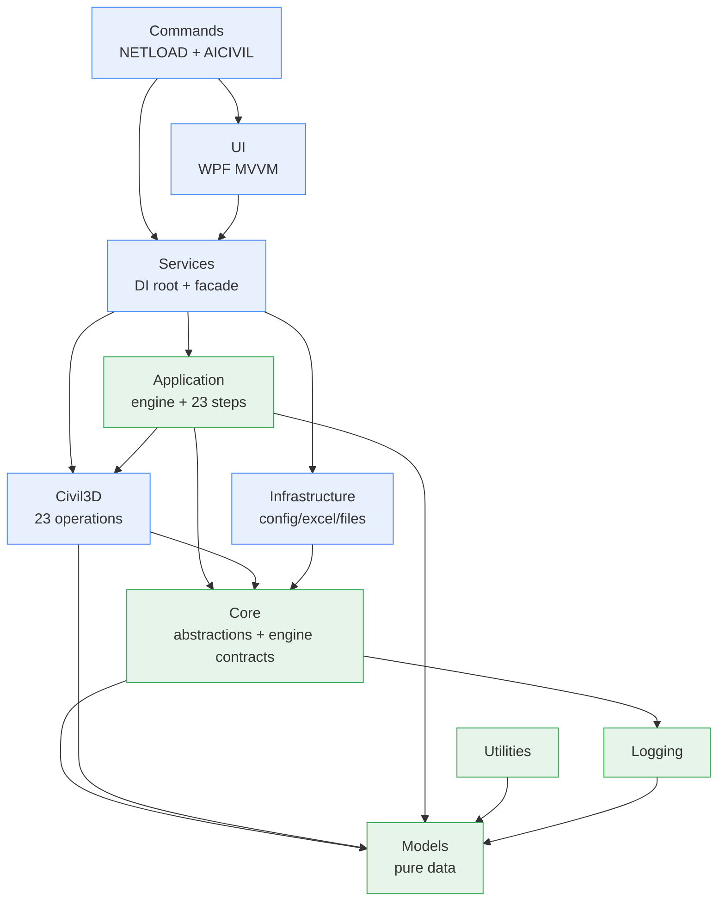
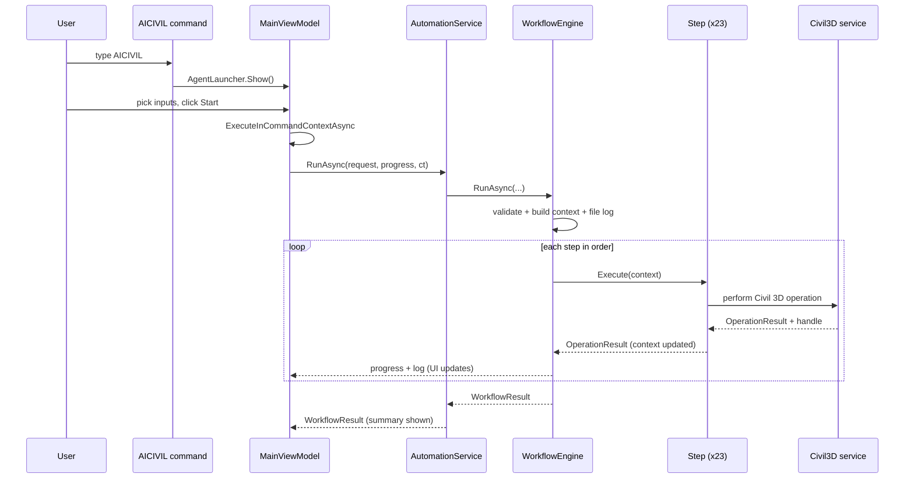

# Architecture

The Civil3D AI Agent follows **clean architecture**: dependencies point inward toward stable
abstractions, and the volatile outer world (Civil 3D, WPF, the file system, Excel) is kept at the
edges behind interfaces.

---

## Layer dependency diagram



ASCII fallback:

```
            ┌───────────┐        ┌───────────┐
            │  Commands │──────► │    UI     │  (WPF, hosted in Civil 3D)
            └─────┬─────┘        └─────┬─────┘
                  │      NETLOAD       │
                  └────────┬───────────┘
                           ▼
                     ┌───────────┐
                     │  Services │  DI composition root + IAutomationService
                     └─────┬─────┘
             ┌─────────────┼───────────────┐
             ▼             ▼               ▼
     ┌────────────┐ ┌────────────┐  ┌────────────────┐
     │Application │ │  Civil3D   │  │ Infrastructure │
     │engine+steps│ │23 ops + PDF│  │ config/excel/io│
     └─────┬──────┘ └─────┬──────┘  └───────┬────────┘
           └──────────────┼─────────────────┘
                          ▼
                    ┌───────────┐
                    │   Core    │  ports + workflow contracts (no Autodesk types)
                    └─────┬─────┘
                          ▼
        ┌────────────┬──────────┬────────────┐
        │   Models   │ Logging  │ Utilities  │   (leaf libraries)
        └────────────┴──────────┴────────────┘
```

**Rule:** only `Civil3D`, `Application`, `Services`, `UI`, and `Commands` reference the Autodesk
assemblies. `Core`, `Models`, `Infrastructure`, `Logging`, and `Utilities` are Autodesk-free and fully
unit-testable.

---

## Responsibilities

| Layer | Responsibility | Autodesk refs? |
|-------|----------------|:--------------:|
| **Models** | Enums, DTOs, config POCOs, result types, geometry snapshot | no |
| **Logging** | `ILogger` + File/UI/Composite/Routing/Null loggers | no |
| **Core** | Ports (`IConfigurationProvider`, `IExcelPointReader`, `IFileService`, `IPdfPublisher`, `IExceptionExplainer`, `IInputValidator`) + workflow contracts (`IWorkflowStep`, `IWorkflowEngine`, `IWorkflowContext`) | no |
| **Utilities** | Pure helpers: unit conversion, naming, token replacement, guards | no |
| **Infrastructure** | JSON config, ClosedXML Excel reading, file service, input validation | no |
| **Civil3D** | The 23 Civil 3D operations, PDF publisher, exception explainer, transaction/style/handle/doc helpers | **yes** |
| **Application** | Workflow engine (timing, recovery, cancellation, progress) + 23 step adapters | yes |
| **Services** | DI composition root + `IAutomationService` facade | yes |
| **UI** | WPF MVVM window, view models, launcher | yes |
| **Commands** | `AICIVIL` command + `IExtensionApplication` load hooks | yes |

---

## Runtime sequence



---

## Key design decisions

- **Handles, not ObjectIds, cross step boundaries.** Steps store persistent AutoCAD handle strings in
  the context; only the Civil3D layer resolves them to live `ObjectId`s. This keeps the orchestration
  layer conceptually clean and avoids stale-id hazards.
- **Result type over exceptions for expected failures.** `OperationResult`/`OperationResult<T>` make
  the "never crash, recover where possible" policy explicit; the engine still catches unexpected
  exceptions at the step boundary as a backstop.
- **Graceful style fallback.** Missing template styles degrade to the first available style with a
  warning, so a slightly-off style name never aborts a run.
- **One composition root.** All wiring lives in `CompositionRoot`; swapping any implementation is a
  one-line change and everything else is constructor-injected.
- **Routing logger.** A single injected logger writes to the UI always and to a per-run file only
  during a run — so service, step, and engine logs all land in the same run log without rebuilding the
  object graph per run.
